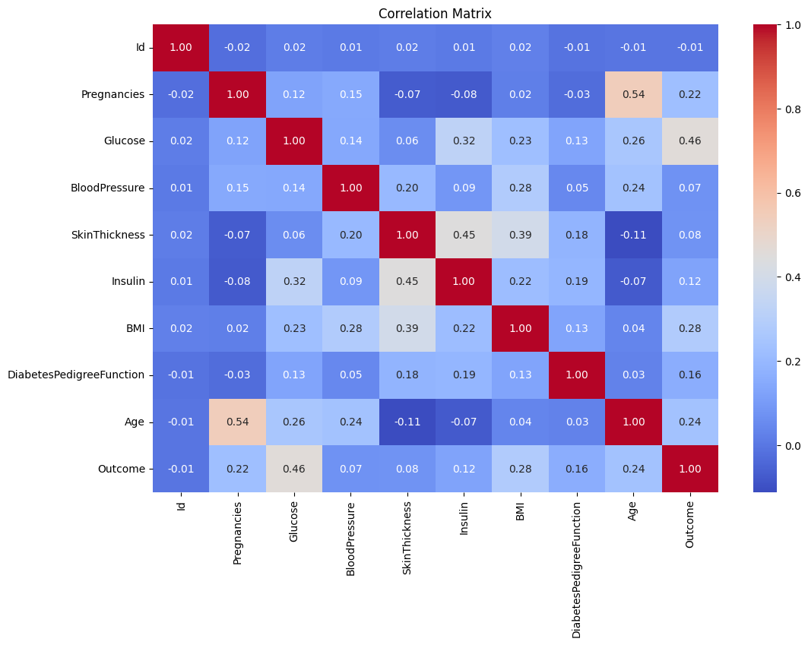
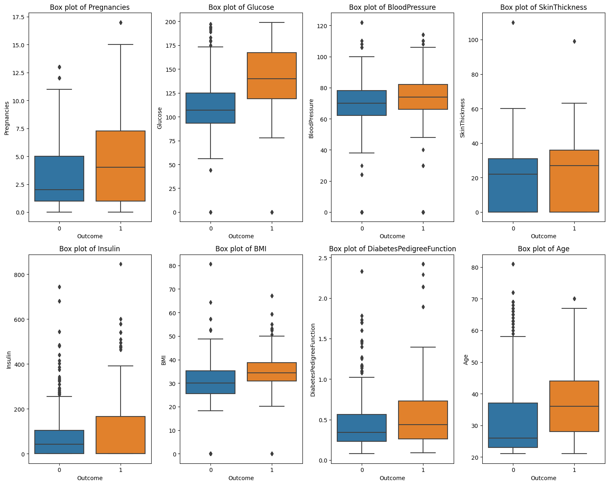
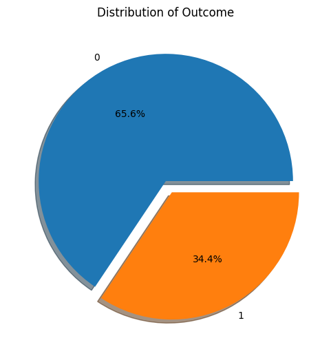

# Diabetes Healthcare Data Analysis

## Objective
To extract valuable insights from a healthcare dataset focused on diabetes for predictive analysis and risk assessment. The goal is to demonstrate analytical skills, especially in a healthcare context.

---

## Methodology

### 1. Descriptive Analysis
- **Initial Data Exploration**:
  - Reviewed the dataset to understand its structure and the types of data it contains. The dataset features include 'Pregnancies', 'Glucose', 'BloodPressure', and others, with an 'Outcome' variable indicating diabetes (1) or not (0).

### 2. Exploratory Data Analysis (EDA)
- **Correlation Matrix**:
  - Calculated correlations between various features to identify key variables that have a significant influence on the 'Outcome'. Notably, 'Glucose', 'BMI', and 'Age' showed strong positive correlations with the 'Outcome'.
  
- **Data Visualization**:
  - Created box plots for each numerical feature, segmented by 'Outcome'. These visualizations provided insights into the distribution of features among individuals with and without diabetes.

### 3. Inferential Statistics
- **T-Tests**:
  - Conducted t-tests to compare the means of different features between the two 'Outcome' groups. All features showed statistically significant differences in means, indicated by very low p-values.
  
- **Confidence Intervals**:
  - Calculated 95% confidence intervals for the mean of each feature for both outcome groups. This provides a range where the true population mean is likely to be found.

### 4. Predictive Modeling
- **Logistic Regression**:
  - Developed a logistic regression model to predict the likelihood of having diabetes based on different health metrics.
  
- **Model Evaluation**:
  - Achieved an accuracy of approximately 77.4%. The model evaluation also included a detailed classification report and confusion matrix.

---

## Key Findings
- High levels of 'Glucose', 'BMI', and 'Age' are strong indicators of diabetes.
- The predictive model could potentially serve as a basic screening tool for diabetes risk assessment.

---

## Recommendations
- Healthcare providers can use these insights for early interventions and personalized treatment plans, focusing on metrics like 'Glucose' and 'BMI'.
- Future studies could incorporate additional features or utilize more advanced machine learning algorithms to improve the predictive accuracy.


# Descriptive Analysis


```python
import pandas as pd
import matplotlib.pyplot as plt
import seaborn as sns

# Load the data into a DataFrame
file_path = 'Healthcare-Diabetes.csv'  # Replace with your file path if different
df = pd.read_csv(file_path)

# Show the first few rows to confirm the data has been loaded
df.head()
```


  <div id="df-cb2dd365-06eb-4797-a5ec-9e1322908bc7" class="colab-df-container">
    <div>
<style scoped>
    .dataframe tbody tr th:only-of-type {
        vertical-align: middle;
    }

    .dataframe tbody tr th {
        vertical-align: top;
    }

    .dataframe thead th {
        text-align: right;
    }
</style>
<table border="1" class="dataframe">
  <thead>
    <tr style="text-align: right;">
      <th></th>
      <th>Id</th>
      <th>Pregnancies</th>
      <th>Glucose</th>
      <th>BloodPressure</th>
      <th>SkinThickness</th>
      <th>Insulin</th>
      <th>BMI</th>
      <th>DiabetesPedigreeFunction</th>
      <th>Age</th>
      <th>Outcome</th>
    </tr>
  </thead>
  <tbody>
    <tr>
      <th>0</th>
      <td>1</td>
      <td>6</td>
      <td>148</td>
      <td>72</td>
      <td>35</td>
      <td>0</td>
      <td>33.6</td>
      <td>0.627</td>
      <td>50</td>
      <td>1</td>
    </tr>
    <tr>
      <th>1</th>
      <td>2</td>
      <td>1</td>
      <td>85</td>
      <td>66</td>
      <td>29</td>
      <td>0</td>
      <td>26.6</td>
      <td>0.351</td>
      <td>31</td>
      <td>0</td>
    </tr>
    <tr>
      <th>2</th>
      <td>3</td>
      <td>8</td>
      <td>183</td>
      <td>64</td>
      <td>0</td>
      <td>0</td>
      <td>23.3</td>
      <td>0.672</td>
      <td>32</td>
      <td>1</td>
    </tr>
    <tr>
      <th>3</th>
      <td>4</td>
      <td>1</td>
      <td>89</td>
      <td>66</td>
      <td>23</td>
      <td>94</td>
      <td>28.1</td>
      <td>0.167</td>
      <td>21</td>
      <td>0</td>
    </tr>
    <tr>
      <th>4</th>
      <td>5</td>
      <td>0</td>
      <td>137</td>
      <td>40</td>
      <td>35</td>
      <td>168</td>
      <td>43.1</td>
      <td>2.288</td>
      <td>33</td>
      <td>1</td>
    </tr>
  </tbody>
</table>
</div>

<style>
  .colab-df-quickchart {
      --bg-color: #E8F0FE;
      --fill-color: #1967D2;
      --hover-bg-color: #E2EBFA;
      --hover-fill-color: #174EA6;
      --disabled-fill-color: #AAA;
      --disabled-bg-color: #DDD;
  }

  [theme=dark] .colab-df-quickchart {
      --bg-color: #3B4455;
      --fill-color: #D2E3FC;
      --hover-bg-color: #434B5C;
      --hover-fill-color: #FFFFFF;
      --disabled-bg-color: #3B4455;
      --disabled-fill-color: #666;
  }

  .colab-df-quickchart {
    background-color: var(--bg-color);
    border: none;
    border-radius: 50%;
    cursor: pointer;
    display: none;
    fill: var(--fill-color);
    height: 32px;
    padding: 0;
    width: 32px;
  }

  .colab-df-quickchart:hover {
    background-color: var(--hover-bg-color);
    box-shadow: 0 1px 2px rgba(60, 64, 67, 0.3), 0 1px 3px 1px rgba(60, 64, 67, 0.15);
    fill: var(--button-hover-fill-color);
  }

  .colab-df-quickchart-complete:disabled,
  .colab-df-quickchart-complete:disabled:hover {
    background-color: var(--disabled-bg-color);
    fill: var(--disabled-fill-color);
    box-shadow: none;
  }

  .colab-df-spinner {
    border: 2px solid var(--fill-color);
    border-color: transparent;
    border-bottom-color: var(--fill-color);
    animation:
      spin 1s steps(1) infinite;
  }

  @keyframes spin {
    0% {
      border-color: transparent;
      border-bottom-color: var(--fill-color);
      border-left-color: var(--fill-color);
    }
    20% {
      border-color: transparent;
      border-left-color: var(--fill-color);
      border-top-color: var(--fill-color);
    }
    30% {
      border-color: transparent;
      border-left-color: var(--fill-color);
      border-top-color: var(--fill-color);
      border-right-color: var(--fill-color);
    }
    40% {
      border-color: transparent;
      border-right-color: var(--fill-color);
      border-top-color: var(--fill-color);
    }
    60% {
      border-color: transparent;
      border-right-color: var(--fill-color);
    }
    80% {
      border-color: transparent;
      border-right-color: var(--fill-color);
      border-bottom-color: var(--fill-color);
    }
    90% {
      border-color: transparent;
      border-bottom-color: var(--fill-color);
    }
  }
</style>

  <script>
    async function quickchart(key) {
      const quickchartButtonEl =
        document.querySelector('#' + key + ' button');
      quickchartButtonEl.disabled = true;  // To prevent multiple clicks.
      quickchartButtonEl.classList.add('colab-df-spinner');
      try {
        const charts = await google.colab.kernel.invokeFunction(
            'suggestCharts', [key], {});
      } catch (error) {
        console.error('Error during call to suggestCharts:', error);
      }
      quickchartButtonEl.classList.remove('colab-df-spinner');
      quickchartButtonEl.classList.add('colab-df-quickchart-complete');
    }
    (() => {
      let quickchartButtonEl =
        document.querySelector('#df-3b43d3fd-307f-4799-aca2-68466dd1b3bd button');
      quickchartButtonEl.style.display =
        google.colab.kernel.accessAllowed ? 'block' : 'none';
    })();
  </script>
</div>
    </div>
  </div>


**The dataset contains the following columns:**

- Id: Identifier for each record
- Pregnancies: Number of times pregnant
- Glucose: Plasma glucose concentration in a 2 hours in an oral glucose tolerance test
- BloodPressure: Diastolic blood pressure (mm Hg)
- SkinThickness: Triceps skin fold thickness (mm)
- Insulin: 2-Hour serum insulin (mu U/ml)
- BMI: Body mass index (weight in kg/(height in m)^2)
- DiabetesPedigreeFunction: Diabetes pedigree function
- Age: Age (years)
- Outcome: Outcome variable (0 or 1), where 1 indicates diabetes and 0 indicates no diabetes

# Exploratory Data Analysis (EDA)

Heat map correlation matrix

The closer the value is to 1 or -1, the stronger the correlation between the variables.

This code is calculating something called a correlation matrix and then creating a visual representation of it using a heatmap. The correlation matrix helps us understand how different variables in the data are related to each other. The heatmap makes it easier to see these relationships visually, with warmer colors indicating stronger positive correlations and cooler colors indicating negative or weak correlations. This can be useful for identifying patterns and relationships in the data.


```python
# Compute the correlation matrix
corr = df.corr()

# Generate a heatmap to visualize the correlation matrix
plt.figure(figsize=(12, 8))
sns.heatmap(corr, annot=True, cmap='coolwarm', fmt=".2f")
plt.title("Correlation Matrix")
plt.show()
```


    

    


Here are some notable observations:

- **Glucose** has a strong positive correlation of 0.47 with the Outcome, indicating that higher glucose levels are associated with diabetes.
- **BMI** and Age also show positive correlations with the Outcome, at 0.29 and 0.24, respectively.
- **Pregnancies** has a positive correlation of 0.22 with the Outcome.
- **DiabetesPedigreeFunction** shows a modest positive correlation of 0.18 with the Outcome.

This code is creating a set of visualizations using box plots and histograms for several numerical features of a dataset. It's dividing the visualization into a 2x4 grid, with each cell in the grid representing a different numerical feature. For each feature, it's creating a box plot to show the distribution of data for two different outcomes (likely binary classes), and the title of each plot indicates which feature it represents. This helps to visually compare the distribution of these features with respect to the outcome variable.


```python
# Set up the matplotlib figure
fig, axes = plt.subplots(2, 4, figsize=(15, 12))

# Data Visualization: Box plots & histograms for numerical features
numerical_features = ['Pregnancies', 'Glucose', 'BloodPressure', 'SkinThickness', 'Insulin', 'BMI', 'DiabetesPedigreeFunction', 'Age']

for i, feature in enumerate(numerical_features):
    row = i // 4
    col = i % 4

    # Box plot
    sns.boxplot(x='Outcome', y=feature, data=df, ax=axes[row, col])
    axes[row, col].set_title(f'Box plot of {feature}')

plt.tight_layout()
plt.show()
```


    

    


The box plots provide a good visual representation of the distribution of each feature, segmented by the Outcome (0 for no diabetes, 1 for diabetes).

Features like **Glucose**, **BMI**, and **Age** show noticeably different distributions between the two outcome groups, reinforcing their importance, which aligns well with the correlation matrix.


```python
# Pie chart for Outcome distribution
plt.figure(figsize=(6, 6))
df['Outcome'].value_counts().plot.pie(explode=[0, 0.1], autopct='%1.1f%%', shadow=True)
plt.title('Distribution of Outcome')
plt.ylabel('')
plt.show()
```


    

    


The pie chart shows the distribution of the Outcome variable. About 65.4% of the data points indicate no diabetes (0), while 34.6% indicate diabetes (1).

# Inferential Statistics

This code is conducting t-tests on numerical features to compare the means of these features between two groups defined by the 'Outcome' variable, which seems to be binary (0 and 1). The code calculates the t-statistic and p-value for each feature. The p-value indicates whether there is a significant difference in the means of that feature between the two outcome groups.

The results of these t-tests are stored in a dictionary called t_test_results, with each feature as a key and its corresponding p-value as the value. Lower p-values suggest that there is a significant difference in the means of that feature between the two outcome groups, while higher p-values suggest no significant difference.


```python
from scipy import stats

# Prepare a dictionary to store the results of t-tests
t_test_results = {}

# Perform t-tests for numerical features to compare means between two Outcome groups (0 and 1)
for feature in numerical_features:
    group0 = df[df['Outcome'] == 0][feature]
    group1 = df[df['Outcome'] == 1][feature]

    # Perform an independent t-test and store the p-value
    t_stat, p_value = stats.ttest_ind(group0, group1)
    t_test_results[feature] = p_value

# Show the p-values for each feature from the t-tests
t_test_results
```


    {'Pregnancies': 9.256928865277502e-33,
     'Glucose': 1.842493335062132e-145,
     'BloodPressure': 0.00012364190089491636,
     'SkinThickness': 6.847260768194687e-05,
     'Insulin': 6.694784556077384e-11,
     'BMI': 2.257376329975137e-51,
     'DiabetesPedigreeFunction': 1.8271988714798856e-17,
     'Age': 1.1675830876280834e-36}


When we talk about a p-value less than 0.05, it basically means that there's strong evidence to say there's a real difference between two groups. In this situation, we're comparing people with diabetes to those without it. And when we looked at all the characteristics or features, they all showed this strong difference, which tells us that these traits are indeed distinct between the two groups.

<h1>Confidence Intervals

This code is trying to find out the average (mean) values of certain measurements for two groups of people: one group with "No Diabetes" and the other with "Diabetes." It's not just giving a single number for the average; it's also providing a range where we can reasonably expect the true average to fall.

Imagine you're trying to figure out how tall people are in two different groups. You don't just say the average height is 5 feet; you say the average height is 5 feet, plus or minus a little bit, to account for some uncertainty. That's what this code is doing for various measurements related to diabetes. It helps us understand the data better and how confident we can be in those averages.


```python
import numpy as np

# Function to calculate the confidence interval
def confidence_interval(data, confidence=0.95):
    mean = np.mean(data)
    sem = stats.sem(data)
    ci = sem * stats.t.ppf((1 + confidence) / 2., len(data) - 1)
    return mean, mean - ci, mean + ci

# Prepare a dictionary to store the results of confidence intervals
ci_results = {}

# Calculate the 95% confidence intervals for the mean of each numerical feature for both Outcome groups (0 and 1)
for feature in numerical_features:
    group0 = df[df['Outcome'] == 0][feature]
    group1 = df[df['Outcome'] == 1][feature]

    ci_results[feature] = {
        'No Diabetes': confidence_interval(group0),
        'Diabetes': confidence_interval(group1)
    }

# Show the confidence intervals
ci_results
```


    {'Pregnancies': {'No Diabetes': (3.204295154185022,
       3.0688865277076722,
       3.339703780662372),
      'Diabetes': (4.769957983193278, 4.531861786958046, 5.008054179428509)},
     'Glucose': {'No Diabetes': (110.41960352422907,
       109.20492739941496,
       111.6342796490432),
      'Diabetes': (141.4810924369748, 139.44662373531983, 143.51556113862975)},
     'BloodPressure': {'No Diabetes': (68.11949339207048,
       67.28846991693133,
       68.95051686720963),
      'Diabetes': (71.0703781512605, 69.72394108908883, 72.41681521343217)},
     'SkinThickness': {'No Diabetes': (19.945484581497798,
       19.250225927036748,
       20.640743235958848),
      'Diabetes': (22.501050420168067, 21.380146789063737, 23.621954051272397)},
     'Insulin': {'No Diabetes': (70.07599118942731,
       65.5551760514817,
       74.59680632737293),
      'Diabetes': (99.30252100840336, 90.83610926153965, 107.76893275526707)},
     'BMI': {'No Diabetes': (30.494988986784143,
       30.125316154182297,
       30.86466181938599),
      'Diabetes': (35.270378151260495, 34.81320865764016, 35.72754764488083)},
     'DiabetesPedigreeFunction': {'No Diabetes': (0.43331552863436124,
       0.41971430967395035,
       0.4469167475947721),
      'Diabetes': (0.5434453781512604, 0.5201677458893859, 0.5667230104131349)},
     'Age': {'No Diabetes': (31.11123348017621,
       30.572606352243277,
       31.649860608109144),
      'Diabetes': (36.98739495798319, 36.29214871380809, 37.682641202158294)}}


**Pregnancies:**
- No Diabetes: 3.20 [3.07, 3.34]
- Diabetes: 4.77 [4.53, 5.01]

**Glucose:**
- No Diabetes: 110.42 [109.20, 111.63]
- Diabetes: 141.48 [139.45, 143.52]

**Blood Pressure:**
- No Diabetes: 68.12 [67.29, 68.95]
- Diabetes: 71.07 [69.72, 72.42]

**Skin Thickness:**
- No Diabetes: 19.95 [19.25, 20.64]
- Diabetes: 22.50 [21.38, 23.62]

**Insulin:**
- No Diabetes: 70.08 [65.56, 74.60]
- Diabetes: 99.30 [90.84, 107.77]

**BMI:**
- No Diabetes: 30.49 [30.13, 30.86]
- Diabetes: 35.27 [34.81, 35.73]

**Diabetes Pedigree Function:**
- No Diabetes: 0.43 [0.42, 0.45]
- Diabetes: 0.54 [0.52, 0.57]

**Age:**
- No Diabetes: 31.11 [30.57, 31.65]
- Diabetes: 36.99 [36.29, 37.68]


These confidence intervals give us a range where we're 95% sure the average value of a population is. This is really important for doctors and people who make decisions based on data.

# Predictive Modeling: Logistic Regression


```python
from sklearn.model_selection import train_test_split
from sklearn.preprocessing import StandardScaler
from sklearn.linear_model import LogisticRegression
from sklearn.metrics import accuracy_score, classification_report, confusion_matrix

# Prepare the features and target variable
X = df[numerical_features]
y = df['Outcome']

# Split the data into training and test sets
X_train, X_test, y_train, y_test = train_test_split(X, y, test_size=0.2, random_state=42)

# Standardize the features
scaler = StandardScaler()
X_train_scaled = scaler.fit_transform(X_train)
X_test_scaled = scaler.transform(X_test)

# Initialize the Logistic Regression model
model = LogisticRegression()

# Train the model
model.fit(X_train_scaled, y_train)

# Make predictions
y_pred = model.predict(X_test_scaled)

# Evaluate the model
accuracy = accuracy_score(y_test, y_pred)
classification_rep = classification_report(y_test, y_pred)
conf_matrix = confusion_matrix(y_test, y_pred)

accuracy, classification_rep, conf_matrix
```


    (0.7743682310469314,
     '              precision    recall  f1-score   support\n\n           0       0.79      0.90      0.84       367\n           1       0.73      0.52      0.61       187\n\n    accuracy                           0.77       554\n   macro avg       0.76      0.71      0.73       554\nweighted avg       0.77      0.77      0.76       554\n',
     array([[331,  36],
            [ 89,  98]]))


Accuracy: The model is right about 77.4% of the time when it predicts if someone has diabetes or not in our test.

Precision: It's 79% accurate when it says someone doesn't have diabetes (class 0) and 73% accurate when it says someone has diabetes (class 1).

Recall: It's 90% accurate at finding people without diabetes and 52% accurate at finding people with diabetes.

F1-Score: The F1-Score, which combines precision and recall, is 84% for class 0 and 61% for class 1.

Confusion Matrix:

True Negative: 331
False Positive: 36
False Negative: 89
True Positive: 98
Overall, the model does pretty well, especially for a simple one like this. It can be a useful tool to screen for diabetes risk based on health data.

To use the model please enter your data.


```python
Pregnancies = 6
Glucose = 148
BloodPressure = 72
SkinThickness = 35
Insulin = 0
BMI = 18.6
DiabetesPedigreeFunction = 0.627
Age = 10
```


```python
# Sample feature data (ensure it matches the same order as the trained model)
sample_data = [[Pregnancies, Glucose, BloodPressure, SkinThickness, Insulin, BMI, DiabetesPedigreeFunction, Age]]

# Standardize the sample data using the same scaler object used for training
sample_data_scaled = scaler.transform(sample_data)

# Use the trained model to make predictions
predicted_outcome = model.predict(sample_data_scaled)

# Interpret the result
if predicted_outcome[0] == 1:
    print("The model predicts that there is a high likelihood of diabetes.")
else:
    print("The model predicts that there is a low likelihood of diabetes.")

```

    The model predicts that there is a low likelihood of diabetes.
    

    /usr/local/lib/python3.10/dist-packages/sklearn/base.py:439: UserWarning: X does not have valid feature names, but StandardScaler was fitted with feature names
      warnings.warn(
    
